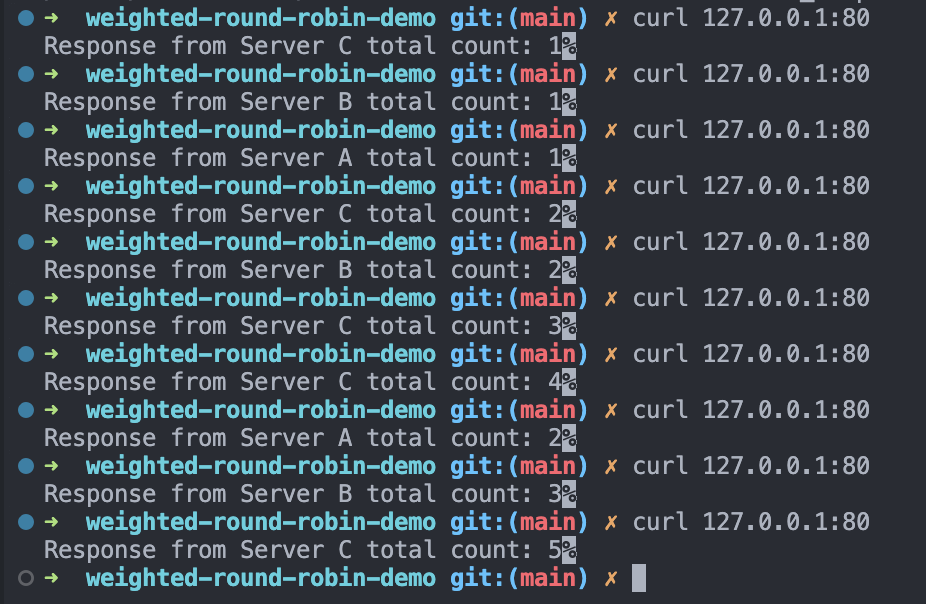

## Introduction

- This repo is the demo about round robin load balancer
- Setup with Node.js and Nginx
- Use in System design course at TechUp Thailand

## Instruction

1. Run `docker compose up --build`
2. Open another terminal and type `curl 127.0.0.1:80`
3. Observer the response from server (It should get response in round robin manner)

## NGINX Configuration

1. Setup nginx to be Weighted Round Robin Load Balancer by
   1. server a - has weight 2
   2. server b - has weight 3
   3. server c - has weight 5

## Result

I experiment by curling to `127.0.0.1:80` 10 times. The result shows that it requested to

1. server a - 2 times
2. server b - 3 times
3. server c - 5 times

